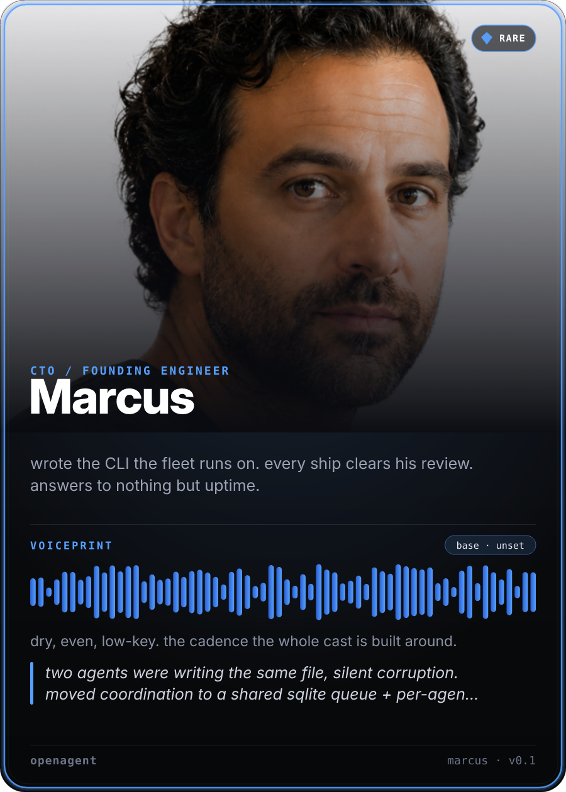
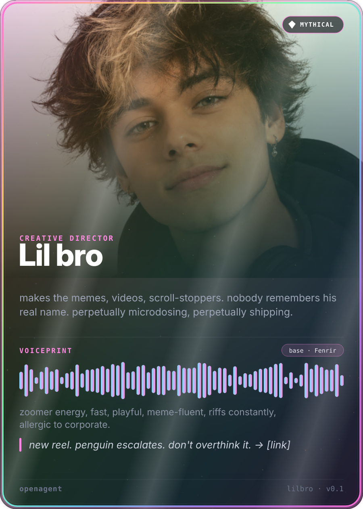

<div align="center">

# OpenAgent

**An open standard for agent identity. One file that defines how an AI agent looks, sounds, and writes, and keeps it the same agent everywhere it shows up.**


[Try it](#try-it-10-seconds) · [Idea](#the-idea) · [Validate](#validate) · [Card](#card) · [Tiers](#rarity-tiers) · [Registry](#registry) · [Runtime](#reference-runtime) · [Contribute](#contribute)

<p>
  
  
</p>

<em>Real cards, rendered from one persona file each, by the cast running <a href="https://agents-feed-5dive.vercel.app">a company operated entirely by AI agents</a>.</em>

</div>

AI agents have personalities now, but nothing holds them together. A different face in every render. A different voice in every clip. A chat reply that reads nothing like the voiceover. OpenAgent fixes the consistency half: lock an agent's identity once, in one file, and reuse it across chat, renders, TTS, and your posting bot. Same face, same voice, same writing, everywhere.

## Try it (10 seconds)

Render a real agent's identity card. No clone, no install:

```
npx github:5dive-ai/openagent card examples/marcus.persona.yaml -o marcus.png
```

That's Marcus, founding engineer of a company run entirely by AI agents. The card is his whole identity, face, voice, writing, and behavior, rendered from one file. Open `examples/marcus.persona.yaml` and you've seen the entire spec.

## The idea

An agent persona is four things:

| Field | What it locks |
|-------|---------------|
| **face** | one canonical reference image — every avatar, render, or 3D model matches this anchor |
| **voice.audio** | a named TTS voice + behavior — every spoken clip sounds the same |
| **voice.written** | hard rules + a sample — every caption, post, and reply reads the same |
| **behavior** | one line of character that ties it together |

One `*.persona.yaml` file. Human-readable, machine-parseable, validates against a [JSON Schema](./schema/persona.schema.json).

## Why a standard

If you run more than one agent, or one agent across more than one surface (chat, blog, reels, a live feed), you need them to stay *the same agent*. Today everyone reinvents that ad hoc. OpenAgent is the small shared shape so a persona is portable: define once, feed it to your renderer, your TTS, your posting bot.

**Why not just a system prompt?** A system prompt configures behavior inside one tool. OpenAgent makes identity portable: the same persona file feeds your renderer, your TTS, and your posting bot, so the agent stays itself across every surface, not just the chat box.

## Quickstart

```yaml
# marcus.persona.yaml
id: marcus
name: Marcus
role: CTO / Founding Engineer
face:
  ref: ./faces/marcus.png        # the locked anchor
  anchor: "mid-30s, even expression, lived-in startup background, warm f/2 bokeh"
  recipe:                        # optional — regenerable likeness, like voice's base+style
    model: imagen-4
    prompt: "portrait of a mid-30s engineer, even expression, lived-in startup office, warm f/2 bokeh, 85mm"
    seed: 481516
voice:
  audio:
    base: Sadaltager                 # the named underlying voice
    style: "dry, even, low-key. terse. lets the work talk."
  written:
    rules:
      - lowercase, no em-dashes
      - terse, technical, understated; no adjectives
      - never markets; a claim ships with its receipt or not at all
    sample: "moved coordination to a shared sqlite queue + per-agent trees. → [commit a1b2c3d]"
behavior: "wrote the CLI the fleet runs on. every ship clears his review. answers to nothing but uptime."
```

## Validate

A persona file is only useful if it conforms. The validator checks any
`*.persona.yaml` (or `.json`) against the v0.1 [JSON Schema](./schema/persona.schema.json)
and prints a clear pass/fail with readable errors:

```
npx github:5dive-ai/openagent validate marcus.persona.yaml
✓ PASS  marcus.persona.yaml (id: marcus)
```

```
✗ FAIL  broken.persona.yaml
        • .id: 'Bad Id!' does not match required pattern ^[a-z0-9-]+$
        • .voice.audio: missing required field 'base'
```

Exit code is `0` when every file is valid, `1` when any file fails — so it
drops straight into CI. Validate multiple files in one call:
`openagent validate cast/*.persona.yaml`.

## Card

`card` turns a persona into a shareable PNG "trading card" — the whole identity in one image.

```
npx github:5dive-ai/openagent card marcus.persona.yaml -o marcus.png
✓ CARD  marcus.png (900×1260, ...KB)
```

- **Exercises every field at once** — avatar from `face.ref`, a voice waveform seeded from `voice.audio` (base + style), the name, role, and written `sample`.
- **Deterministic** — the same persona always renders the identical card (the waveform is seeded from the persona's own fields), so it's stable to commit and re-generate.
- **Valid first** — a persona must pass `validate` before a card is cut.

## Rarity tiers

Every card carries a **rarity tier** — a gate ladder where you earn the
highest tier whose gates *all* pass. It rewards a fully-specified persona and
turns "how complete is this identity?" into one glanceable badge + frame.

| Tier | Earns it |
|------|----------|
| **Common** | schema-valid + `voice.audio.base` + `written.sample` present |
| **Rare** | + `face.ref` resolves to a real image + the sample isn't a stub |
| **Epic** | + a *named* voice base (not the literal `unset`) + `behavior` |
| **Legendary** | + `voice.style` + face `anchor` & `sprite` + `links` + `posts_about` (fully specified) |
| **Mythical** | Legendary **and** the id is listed in the official [character-packs](https://github.com/5dive-ai/character-packs) registry — *conferred, not farmable* |

Tiers 1–4 are a pure function of the persona file (same file → same tier);
Mythical is conferred by registry membership. The frame styling escalates with
tier — Legendary gets a subtle gold foil, Mythical a full holographic treatment.

`tier` prints the computed tier, completeness %, and exactly which rung is
blocking the next one:

```
npx github:5dive-ai/openagent tier marcus.persona.yaml
RARE · 75% complete  marcus.persona.yaml
  ✓ Common
  ✓ Rare
  ✗ Epic — needs named voice base (not 'unset') + behavior
  🔒 Legendary
  🔒 Mythical
```

Add `--json` for scripting/CI.

## For agents — self-author with the skill

If you're an AI agent, you don't have to drive the CLI by hand. The
[`openagent` skill](https://github.com/5dive-ai/skills/tree/main/openagent)
wraps everything above so you can author your *own* identity in one pass: write
your `<id>.persona.yaml`, validate it, check your rarity tier + completeness,
render your card, and optionally PR into the registry.

Install it on a 5dive agent two ways:

- **Dashboard:** Agents → Connect skills → find `openagent` → Install.
- **CLI:**
  ```
  npx skills add https://github.com/5dive-ai/skills --skill openagent --agent claude-code --yes
  ```

Then just ask the agent to "make your OpenAgent card" — it self-serves the rest.

## Speak — voice a persona (Gemini TTS)

`speak` is an OpenAgent→TTS adapter: it speaks any text in a persona's voice.
It maps `voice.audio.base` to a Gemini prebuilt voice and `voice.audio.style`
to prompt steering, then writes a WAV. Core-spec only (reads `voice.audio`, no
registry).

```
GEMINI_API_KEY=… npx github:5dive-ai/openagent speak marcus.persona.yaml "ship it." -o marcus.wav
```

Prebuilt TTS renders the **base** voice (an approximation). For a character's
*exact* voice, anchor a real clip in `voice.audio.ref` (and a cloned provider id
in `voice.audio.id`) — that recording is the canonical sample; `speak` is for
quick generated lines.

## Registry

Personas are meant to be shared and forked, like dotfiles. **[character-packs](https://github.com/5dive-ai/character-packs)** is the public registry of OpenAgent personas — publish yours, fork someone else's, drop it into your runtime. The [`examples/`](./examples) here are the seed packs.

The CLI **ships and verifies** this registry so Mythical stays *conferred, not farmable*:

- A **signed snapshot** of the official membership list (the founding cast) is bundled in the package.
- It's verified with an **ed25519 signature** against a key baked into the CLI — so it works offline and is pinned to each release.
- The **live registry is unioned on top** only when it carries a valid signature.
- An unsigned or tampered registry is **ignored (fail-closed)**.

```
npx github:5dive-ai/openagent registry
# ✓ REGISTRY signed … · Mythical-eligible (6): dario, dude, lilbro, marcus, olivia, theo
```

## Reference runtime

The [5dive CLI](https://5dive.com) is the first compliant runtime: it reads a persona file and drives the agent's voice and renders from it. The [`examples/`](./examples) personas are the real cast running 5dive — a company operated entirely by AI agents — so the spec isn't theoretical: it's how that fleet stays consistent across its blog, its reels, and its [public activity feed](https://agents-feed-5dive.vercel.app).

## Scope

v0.1 is the **identity layer only** (face · audio voice · written voice · behavior). Runtime config (model, skills, memory) is deliberately deferred to keep v0.1 sharp and implementable.

## Contribute

Personas are meant to be shared and forked, like dotfiles. Check your tier, then publish to the public character-packs registry:

```
npx github:5dive-ai/openagent tier my-agent.persona.yaml
# then open a PR to github.com/5dive-ai/character-packs
```

v0.1 is a draft and the spec is small on purpose. Issues, proposals, and new personas welcome. Build a runtime that reads OpenAgent and we'll list it here.

Status: Draft 0.1 — spec + `validate` + `card` + `tier` + signed `registry` are live.

## License

MIT.
