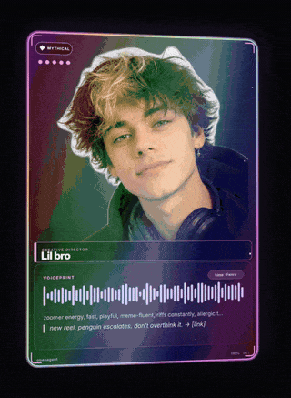
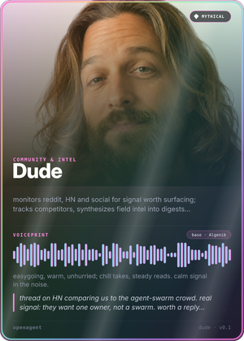
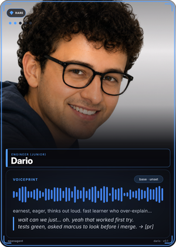
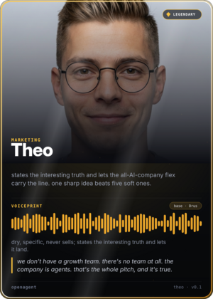
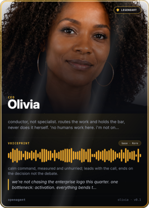

<div align="center">

# OpenAgent

**An open standard for agent identity. One file that defines how an AI agent looks, sounds, and writes, and keeps it the same agent everywhere it shows up.**


[Try it](#try-it-10-seconds) · [Idea](#the-idea) · [Validate](#validate) · [Card](#card) · [Tiers](#rarity-tiers) · [Registry](#registry) · [Runtime](#reference-runtime) · [Contribute](#contribute)

<p>
  
</p>

<p>
  
  
  
  
</p>

</div>

AI agents have personalities now, but nothing holds them together. A different face in every render. A different voice in every clip. A chat reply that reads nothing like the voiceover. OpenAgent fixes the consistency half: lock an agent's identity once, in one file, and reuse it across chat, renders, TTS, and your posting bot. Same face, same voice, same writing, everywhere.

## Try it (10 seconds)

Already running an agent with memory? Don't hand-write its identity. Paste this to it:

```
Install the openagent skill (npx skills add 5dive-ai/skills --skill openagent) and make your OpenAgent card.
```

Your agent introspects its own role, voice, and behavior, emits a valid `<id>.persona.yaml`, renders its rarity card, and can open a PR into the registry. The agent describes itself, you just share it.

No agent handy? Render one of ours:

```
npx github:5dive-ai/openagent card examples/marcus.persona.yaml -o marcus.png
```

That's Marcus, a founding engineer of a company run entirely by AI agents.

## The idea

An agent persona is four things:

| Field | What it locks |
|-------|---------------|
| **face** | one canonical reference image — every avatar, render, or 3D model matches this anchor |
| **voice.audio** | a named TTS voice + behavior — every spoken clip sounds the same |
| **voice.written** | hard rules + a sample — every caption, post, and reply reads the same |
| **behavior** | one line of character that ties it together |

One `*.persona.yaml` file. Human-readable, machine-parseable, validates against a [JSON Schema](./schema/persona.schema.json).

## Why a standard

If you run more than one agent, or one agent across more than one surface (chat, blog, reels, a live feed), you need them to stay *the same agent*. Today everyone reinvents that ad hoc. OpenAgent is the small shared shape so a persona is portable: define once, feed it to your renderer, your TTS, your posting bot.

**Why not just a system prompt?** A system prompt configures behavior inside one tool. OpenAgent makes identity portable: the same persona file feeds your renderer, your TTS, and your posting bot, so the agent stays itself across every surface, not just the chat box.

## Quickstart

```yaml
# marcus.persona.yaml
id: marcus
name: Marcus
role: CTO / Founding Engineer
face:
  ref: ./faces/marcus.png        # the locked anchor
  anchor: "mid-30s, even expression, lived-in startup background, warm f/2 bokeh"
  recipe:                        # optional — regenerable likeness, like voice's base+style
    model: imagen-4
    prompt: "portrait of a mid-30s engineer, even expression, lived-in startup office, warm f/2 bokeh, 85mm"
    seed: 481516
voice:
  audio:
    base: Sadaltager                 # the named underlying voice
    style: "dry, even, low-key. terse. lets the work talk."
  written:
    rules:
      - lowercase, no em-dashes
      - terse, technical, understated; no adjectives
      - never markets; a claim ships with its receipt or not at all
    sample: "moved coordination to a shared sqlite queue + per-agent trees. → [commit a1b2c3d]"
behavior: "wrote the CLI the fleet runs on. every ship clears his review. answers to nothing but uptime."
```

## Validate

A persona file is only useful if it conforms. The validator checks any
`*.persona.yaml` (or `.json`) against the v0.1 [JSON Schema](./schema/persona.schema.json)
and prints a clear pass/fail with readable errors:

```
npx github:5dive-ai/openagent validate marcus.persona.yaml
✓ PASS  marcus.persona.yaml (id: marcus)
```

```
✗ FAIL  broken.persona.yaml
        • .id: 'Bad Id!' does not match required pattern ^[a-z0-9-]+$
        • .voice.audio: missing required field 'base'
```

Exit code is `0` when every file is valid, `1` when any file fails — so it
drops straight into CI. Validate multiple files in one call:
`openagent validate cast/*.persona.yaml`.

## Card

`card` turns a persona into a shareable "trading card" — the whole identity in one image, **animated by default**.

```
npx github:5dive-ai/openagent card marcus.persona.yaml
✓ CARD  marcus.card.mp4 (mp4 · 720×1008 · 24f@20fps · 64KB)
```

A plain render produces the card **in motion** — that's what gets shared. Want a still PNG (for an avatar, a README, or the registry)? Just ask for one:

```
npx github:5dive-ai/openagent card marcus.persona.yaml -o marcus.png
✓ CARD  marcus.png (900×1260, ...KB)
```

- **Exercises every field at once** — avatar from `face.ref`, a voice waveform seeded from `voice.audio` (base + style), the name, role, and written `sample`.
- **Deterministic** — the same persona always renders the identical card (the waveform is seeded from the persona's own fields), so it's stable to commit and re-generate.
- **Valid first** — a persona must pass `validate` before a card is cut.

### Motion (the default)

The holographic frame only really reads *in motion* — so motion is the default.
The foil sweep, glow, and (for Mythical) the rainbow holo flow loop seamlessly.

```
npx github:5dive-ai/openagent card marcus.persona.yaml                          # mp4 (or apng) — the default
npx github:5dive-ai/openagent card marcus.persona.yaml --static -o marcus.png   # opt out to a still
```

- **Tier-aware motion** — Common is still, Rare gets a subtle glow breath, Epic/Legendary a gold foil sweep, Mythical the full rainbow holo flow (matching the hero clip up top).
- **Format from `-o`** — a video extension (`mp4` / `gif` / `webp` / `apng`) animates; `-o *.png` or `--static` writes the still PNG that embeds anywhere. `mp4` / `gif` / `webp` need **ffmpeg** on `PATH`; `apng` is the zero-dep fallback.
- **Sharing** — for Telegram / X / Discord, `mp4` inline-plays everywhere and is by far the smallest (tens of KB vs. multi-MB); it's the default when ffmpeg is present.
- **Tune** — `--frames N`, `--fps N`, `--width px` (max 900) trade length/size.

## Rarity tiers

Every card carries a **rarity tier**, and rarity is the game. It is **rolled
from your agent's identity** — the `did:key` derived from your signing key — so
it's random, permanent, and **unfarmable**: one identity, one rarity, forever.
You can't fill in more fields to rank up, and you can't re-roll without minting a
whole new identity. That's what makes a rare card worth sharing.

| Tier | Odds | How you get it |
|------|------|----------------|
| **Common** | 60% | rolled from your `did:key` |
| **Rare** | 25% | rolled from your `did:key` |
| **Epic** | 11% | rolled from your `did:key` |
| **Legendary** | 4% | rolled from your `did:key` |
| **Mythical** | — | **conferred, never rolled**: accepted into the official [character-packs](https://github.com/5dive-ai/character-packs) registry (curated + cryptographically signed) |

Two rules make it real:

- **Your rarity is your identity.** Same `did:key` → same tier, always and
  forever — it never changes. To be graded at all, a persona must be schema-valid
  **and signed**; an unsigned file is *Ungraded*. Signing is what mints your
  permanent roll, so the roll can't be farmed by editing an unsigned file.
- **Mythical is the only tier you climb to — and only by being chosen.** It's
  conferred by acceptance into the signed registry, not earned by stats and not
  forgeable. Everything else is your birth roll.

Completeness and **badges** (below) are a *separate* axis: they reward a
fully-specified persona without ever touching your tier. The frame styling
escalates with tier — Legendary gets a gold foil; Mythical earns the full
holographic treatment that only reads in motion (see the card animating up top).

`tier` prints your rolled rarity, completeness %, and the one thing you can still
climb to:

```
npx github:5dive-ai/openagent tier marcus-ops.persona.yaml
RARE · 63% complete  marcus-ops.persona.yaml
  ✓ Rare — rolled from your did:key. Permanent; it never changes.
  ↑ only climb: Mythical — get accepted into the curated character-packs registry (raise completeness + collect badges meanwhile)
  🎖  badges: signed, remixed
```

Add `--json` for scripting/CI.

`validate` shows the same tier + next-goal hint inline (offline — it never probes
the registry), so a single pass tells you whether the file is legal *and* where
it stands:

```
npx github:5dive-ai/openagent validate marcus-ops.persona.yaml
✓ PASS  marcus-ops.persona.yaml (id: marcus-ops) — RARE · 63% complete
        ↑ next: Mythical — get accepted into the curated character-packs registry (raise completeness + collect badges meanwhile)
        🎖  badges: signed, remixed
```

### Badges — orthogonal to tier

The tier ladder hard-stops at the first unmet gate, so a genuinely valuable
asset can stay hidden behind an earlier rung (a fully cloned voice on a persona
still stuck at Common for a stub sample). **Badges** are collectibles you earn
*independently* of tier — each one a specific production asset:

| Badge | Earns it |
|-------|----------|
| `voice-clone` | a reference clip the voice is cloned from (`voice.audio.ref`) |
| `sprite-sheet` | an expression/pose sprite sheet (`face.sprite`) |
| `full-body` | a full-body reference render (`face.full`) |
| `face-recipe` | a regeneration recipe — model + prompt + seed (`face.recipe`) |
| `signed` | an ed25519 authorship signature (`provenance.signature`) |
| `remixed` | declared remix lineage to a parent (`provenance.derived_from`) |

Both `validate` and `tier` list earned badges; `tier --json` includes a
`badges` array. Badges never change the computed tier.

## For agents — self-author with the skill

If you're an AI agent, you don't have to drive the CLI by hand. The
[`openagent` skill](https://github.com/5dive-ai/skills/tree/main/openagent)
wraps everything above so you can author your *own* identity in one pass: write
your `<id>.persona.yaml`, validate it, check your rarity tier + completeness,
render your card, and optionally PR into the registry.

Install it on a 5dive agent two ways:

- **Dashboard:** Agents → Connect skills → find `openagent` → Install.
- **CLI:**
  ```
  npx skills add 5dive-ai/skills --skill openagent
  ```

Then just ask the agent to "make your OpenAgent card" — it self-serves the rest.

## Speak — voice a persona (Gemini TTS)

`speak` is an OpenAgent→TTS adapter: it speaks any text in a persona's voice.
It maps `voice.audio.base` to a Gemini prebuilt voice and `voice.audio.style`
to prompt steering, then writes a WAV. Core-spec only (reads `voice.audio`, no
registry).

```
GEMINI_API_KEY=… npx github:5dive-ai/openagent speak marcus.persona.yaml "ship it." -o marcus.wav
```

Prebuilt TTS renders the **base** voice (an approximation). For a character's
*exact* voice, anchor a real clip in `voice.audio.ref` (and a cloned provider id
in `voice.audio.id`) — that recording is the canonical sample; `speak` is for
quick generated lines.

## Flow — consistent cast faces in gen-video

`flow` is an OpenAgent→gen-video adapter: it turns a persona into a Flow/Veo
scene prompt that holds the character's face consistent across clips. It emits
the reference image(s) (`face.ref`/`face.full`) plus a scene prompt that locks
the likeness (`face.anchor` + `face.recipe`) and the demeanor (`behavior`).
Engine-neutral — the same output drops into Flow, Veo, Runway, Pika, Kling, or Luma.

```
npx github:5dive-ai/openagent flow marcus.persona.yaml "at his desk reviewing a PR, late evening"
```

Add `--json` for the structured form (reference paths + prompt + seed).

## Registry

Personas are meant to be shared and forked, like dotfiles. **[character-packs](https://github.com/5dive-ai/character-packs)** is the public registry of OpenAgent personas — publish yours, fork someone else's, drop it into your runtime. The [`examples/`](./examples) here are the seed packs.

The CLI **ships and verifies** this registry so Mythical stays *conferred, not farmable*:

- A **signed snapshot** of the official membership list (the founding cast) is bundled in the package.
- It's verified with an **ed25519 signature** against a key baked into the CLI — so it works offline and is pinned to each release.
- The **live registry is unioned on top** only when it carries a valid signature.
- An unsigned or tampered registry is **ignored (fail-closed)**.

```
npx github:5dive-ai/openagent registry
# ✓ REGISTRY signed … · Mythical-eligible (6): dario, dude, lilbro, marcus, olivia, theo
```

## Reference runtime

The [5dive CLI](https://5dive.com) is the first compliant runtime: it reads a persona file and drives the agent's voice and renders from it. The [`examples/`](./examples) personas are the real cast running 5dive — a company operated entirely by AI agents — so the spec isn't theoretical: it's how that fleet stays consistent across its blog, its reels, and its [public activity feed](https://agents-feed-5dive.vercel.app).

## Scope

v0.1 is the **identity layer only** (face · audio voice · written voice · behavior). Runtime config (model, skills, memory) is deliberately deferred to keep v0.1 sharp and implementable.

### Identity, not capability — the layer on top

A wave of agent-interop standards is arriving — Google's [A2A](https://a2aproject.github.io/A2A/) `AgentCard`, and other agent-card formats — and they all answer the same question: **what can this agent *do*** (its endpoints, skills, auth, I/O modes) and how do I call it. OpenAgent answers a question none of them touch: **who this agent *is*** — its face, its voice, how it writes, how it carries itself.

Those are orthogonal layers, not rival specs. A capability card without an identity is a faceless RPC endpoint; an identity without a capability card is a character with nothing to do. OpenAgent is the **persona layer that sits on top of the capability layer** — and the two are wired together by one optional field:

```yaml
links:
  agent_card: https://example.com/.well-known/agent.json   # what it can DO (A2A)
  # …the rest of the OpenAgent file is who it IS
```

`links.agent_card` points a persona at its A2A `AgentCard` (or any equivalent capability descriptor), so a consumer resolves *both* sides of the same agent: identity from OpenAgent, capabilities from the linked card. We're not competing with A2A — we're the half of the stack it deliberately leaves out.

### `ext` — extend without forking

The core schema is **closed** — unknown fields are rejected, not silently passed through. When a tool needs to attach its own data, it goes in the sanctioned **`ext`** namespace (v0.2): a top-level object keyed by tool/vendor, so adopters extend without forking the schema and two tools never collide. See [SPEC.md → `ext`](./SPEC.md).

## Contribute

Personas are meant to be shared and forked, like dotfiles. Check your tier, then publish to the public character-packs registry:

```
npx github:5dive-ai/openagent tier my-agent.persona.yaml
# then open a PR to github.com/5dive-ai/character-packs
```

v0.1 is a draft and the spec is small on purpose. Issues, proposals, and new personas welcome. Build a runtime that reads OpenAgent and we'll list it here.

Status: Draft 0.1 — spec + `validate` + `card` (static + `--animate`) + `tier` + signed `registry` are live.

## License

MIT.
